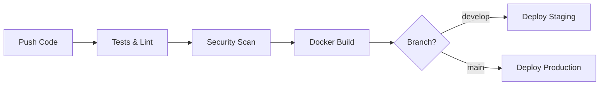

# 🚀 Guide de Déploiement AuthGuard

Ce guide explique comment utiliser la pipeline CI/CD mise en place pour **AuthGuard**.

## 📋 Table des Matières

- [Vue d'ensemble](#vue-densemble)
- [Prérequis](#prérequis)
- [Configuration](#configuration)
- [Déploiement Local](#déploiement-local)
- [Pipeline CI/CD](#pipeline-cicd)
- [Déploiement en Production](#déploiement-en-production)
- [Monitoring](#monitoring)
- [Dépannage](#dépannage)

## 🎯 Vue d'ensemble

La pipeline CI/CD d'AuthGuard comprend :

- ✅ **Tests automatisés** avec Jest
- 🧹 **Linting** avec ESLint  
- 🔒 **Analyse de sécurité** avec CodeQL
- 🐳 **Build et push Docker** automatiques
- 🚀 **Déploiement automatique** sur staging/production
- 📊 **Health checks** et monitoring

### Workflow



## ⚙️ Prérequis

### Développement Local
- Node.js 18+
- Docker & Docker Compose
- PostgreSQL (optionnel, via Docker)

### Production
- Serveur Linux (Ubuntu/Debian recommandé)
- Docker & Docker Compose
- Nom de domaine configuré
- Certificat SSL (automatique avec Let's Encrypt)

## 🔧 Configuration

### 1. Variables d'Environnement

Copie et configure les variables d'environnement :

```bash
# Pour la production
cp env.production.example .env.production
```

**Variables importantes à configurer :**

```bash
# Secrets (générer avec: openssl rand -base64 64)
JWT_SECRET=your_jwt_secret_here
REFRESH_TOKEN_SECRET=your_refresh_secret_here
POSTGRES_PASSWORD=your_db_password_here

# Domaine pour SSL
DOMAIN_NAME=api.yourdomain.com
CERTBOT_EMAIL=admin@yourdomain.com
```

### 2. GitHub Secrets

Configure ces secrets dans ton repo GitHub (`Settings > Secrets and variables > Actions`) :

| Secret | Description |
|--------|-------------|
| `POSTGRES_PASSWORD` | Mot de passe PostgreSQL |
| `JWT_SECRET` | Clé secrète JWT |
| `REFRESH_TOKEN_SECRET` | Clé secrète refresh token |
| `REDIS_PASSWORD` | Mot de passe Redis |

### 3. Environments GitHub

Configure les environnements dans `Settings > Environments` :

- **staging** : Déploiement automatique depuis `develop`
- **production** : Déploiement avec approbation depuis `main`

## 🏠 Déploiement Local

### Développement
```bash
# Installation des dépendances
npm install

# Base de données (via Docker)
docker-compose -f docker/docker-compose.yml up -d postgres

# Migration de la DB
npm run prisma:migrate

# Lancement en mode dev
npm run dev
```

### Production Locale
```bash
# Build et déploiement complet
./scripts/deploy.sh

# Ou avec options
./scripts/deploy.sh --environment production --skip-tests
```

## 🔄 Pipeline CI/CD

### Déclenchement Automatique

La pipeline se déclenche sur :
- **Push** sur `main` ou `develop`
- **Pull Request** vers `main`

### Étapes de la Pipeline

1. **🧪 Tests & Linting**
   - Installation des dépendances
   - Tests Jest avec couverture
   - Linting ESLint
   - Build TypeScript

2. **🔒 Security Scan**
   - Audit npm
   - Analyse CodeQL
   - Scan des vulnérabilités

3. **🐳 Docker Build**
   - Build multi-stage optimisé
   - Push vers GitHub Container Registry
   - Cache des layers

4. **🚀 Déploiement**
   - **develop** → Staging automatique
   - **main** → Production avec approbation

### État des Builds

Consulte l'état dans l'onglet **Actions** de GitHub :
- ✅ Vert : Pipeline réussie
- ❌ Rouge : Échec (vérifier les logs)
- 🟡 Jaune : En cours

## 🎯 Déploiement en Production

### Déploiement Manuel

```bash
# Cloner le repo sur ton serveur
git clone https://github.com/ton-utilisateur/auth-guard.git
cd auth-guard

# Configurer l'environnement
cp env.production.example .env.production
# Éditer .env.production avec tes valeurs

# Déployer
./scripts/deploy.sh --environment production
```

### Déploiement Automatique

1. **Push sur develop** → Déploiement staging automatique
2. **Push/Merge sur main** → Déploiement production (avec approbation)

### Commandes Utiles

```bash
# Voir les conteneurs
docker-compose -f docker/docker-compose.prod.yml ps

# Logs de l'application
docker-compose -f docker/docker-compose.prod.yml logs authguard-api

# Redémarrer un service
docker-compose -f docker/docker-compose.prod.yml restart authguard-api

# Sauvegarder la DB
docker-compose -f docker/docker-compose.prod.yml exec postgres pg_dump -U authguard authguard > backup.sql
```

## 📊 Monitoring

### Health Checks

- **Application** : `GET /health`
- **Base de données** : Health check PostgreSQL intégré
- **Cache** : Health check Redis intégré

### Logs

```bash
# Logs applicatifs
docker-compose logs -f authguard-api

# Logs nginx
docker-compose logs -f nginx

# Logs base de données
docker-compose logs -f postgres
```

### Métriques

Les conteneurs exposent des métriques via :
- Health checks Docker
- Logs structurés
- Monitoring Prometheus (à ajouter)

## 🔧 Dépannage

### Problèmes Courants

#### 1. Échec des Tests
```bash
# Lancer les tests localement
npm run test

# Avec plus de détails
npm run test -- --verbose
```

#### 2. Problème de Build Docker
```bash
# Build manuel pour debug
docker build -f docker/Dockerfile.prod -t auth-guard:debug .

# Vérifier l'image
docker run -it auth-guard:debug /bin/sh
```

#### 3. Base de Données Non Accessible
```bash
# Vérifier le statut PostgreSQL
docker-compose ps postgres

# Se connecter à PostgreSQL
docker-compose exec postgres psql -U authguard -d authguard
```

#### 4. Certificat SSL
```bash
# Renouveler le certificat
docker-compose run --rm certbot renew

# Test SSL
curl -I https://api.yourdomain.com
```

### Logs de Debug

```bash
# Pipeline GitHub Actions : Onglet Actions > Workflow > Job
# Application : docker-compose logs authguard-api
# Système : journalctl -u docker
```

## 🚀 Optimisations

### Performance
- Cache Redis activé
- Images Docker multi-stage
- Compression gzip (nginx)
- Rate limiting configuré

### Sécurité
- Utilisateur non-root dans Docker
- Secrets via variables d'environnement
- Analyse de sécurité automatique
- HTTPS obligatoire

### Haute Disponibilité
- Health checks sur tous les services
- Restart automatique des conteneurs
- Volumes persistants pour les données

---

## 📞 Support

Pour toute question :
1. Consulte les **logs** de la pipeline
2. Vérifie la **configuration** des secrets
3. Teste en **local** d'abord
4. Ouvre une **issue** sur GitHub

Bon déploiement ! 🚀 